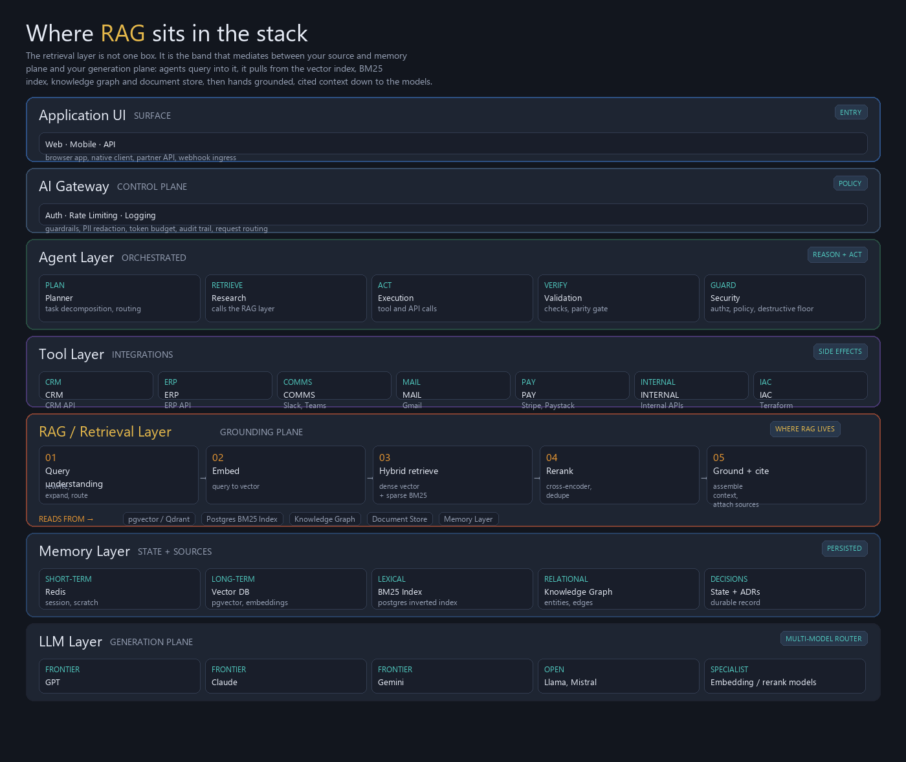

# Unit Test Generation Agent

[](https://github.com/kogunlowo123/unit-test-generation-agent/actions/workflows/ci.yml)
[](https://www.python.org/downloads/)
[](https://opensource.org/licenses/MIT)

> **Category**: Software Engineering | **Cloud**: MULTI-CLOUD | **LLM**: gpt-4o

Intelligent test generator that analyzes source code to produce comprehensive unit tests with proper mocking, edge case coverage, mutation testing verification, and coverage gap identification using property-based and example-based approaches.

---

## Domain-Specific Tools

| Tool | Description |
|------|-------------|
| `generate_unit_tests` | Generate unit tests for a function or class |
| `generate_mocks` | Generate mock objects and test doubles |
| `find_edge_cases` | Identify untested edge cases and boundary conditions |
| `run_mutation_testing` | Run mutation testing to verify test effectiveness |
| `analyze_coverage_gaps` | Identify uncovered code paths and branches |
| `generate_property_tests` | Generate property-based tests using Hypothesis/fast-check |

## API Endpoints

| Method | Path | Description |
|--------|------|-------------|
| `POST` | `/api/v1/tests/generate` | Generate unit tests |
| `POST` | `/api/v1/tests/mocks` | Generate mock objects |
| `POST` | `/api/v1/tests/edge-cases` | Find untested edge cases |
| `POST` | `/api/v1/tests/mutations` | Run mutation testing |
| `POST` | `/api/v1/tests/coverage-gaps` | Identify coverage gaps |
| `POST` | `/api/v1/tests/property` | Generate property-based tests |

## Features

- Test Generation
- Mock Generation
- Edge Case Discovery
- Mutation Testing
- Coverage Analysis

## Integrations

- Github Connector
- Test Runner
- Coverage Reporter
- Mutation Engine

## Architecture



*Where RAG sits in the stack — the 7-layer enterprise AI agent architecture.*


```
unit-test-generation-agent/
│
├── modules/                              # Per-cloud building blocks
│   ├── contracts/                        # Cloud-agnostic interface contracts
│   │   ├── network.md                    # VPC/VNet with private subnets
│   │   ├── vectorstore.md                # Vector search, BM25, hybrid, metadata filter
│   │   ├── object-store.md               # Encrypted object storage
│   │   └── inference-gateway.md          # LLM chat, embeddings, reranking
│   ├── netops/                           # Network boundary (VPC, subnets, SGs)
│   ├── secops/                           # Keys, identity, guardrails
│   ├── appops/                           # Data and model plane
│   └── devops/                           # State backend and CI/CD
│
├── blueprints/                           # RAG topologies that compose modules
│   ├── rag-naive/                        # Keyword-only (pilot)
│   ├── rag-hybrid/                       # Keyword + vector + reranker (production)
│   ├── rag-graph/                        # Entity-relationship graph retrieval
│   ├── rag-multimodal/                   # Text + image + table retrieval
│   └── rag-agentic/                      # RAG as a tool in multi-agent system
│
├── live/                                 # Real environments, pinned versions
│   ├── _bootstrap/aws/                   # One-time state bucket creation
│   ├── dev/us/rag-hybrid/                # Development
│   ├── staging/                          # Pre-production
│   └── prod/                             # Production
│
├── factory/                              # Stamping machinery
│   ├── scaffold.sh                       # Stamps a blueprint into live/
│   └── catalog.yaml                      # Registry of available patterns
│
├── platform/                             # Agentic RAG reference implementation
│   └── reference-apps/reference-agentic-rag/
│       ├── app/contracts/                # DataLane enum, models, tenancy
│       ├── app/search/                   # FULL search pipeline
│       │   ├── retrievers/               # bm25, dense, hybrid, graph, parent_doc
│       │   ├── reranking/                # cross_encoder, llm_rerank, boost, cascade
│       │   ├── query/                    # classify, rewrite, expand, hyde, decompose
│       │   ├── multi_hop/                # budget, planner, executor, synthesizer
│       │   ├── corrective/               # self_critique, web_fallback
│       │   ├── adaptive/router.py        # Public facade for all search
│       │   └── cache/                    # exact, semantic, redis backend
│       └── data/raw_examples/            # Sample data (indexed, live, structured lanes)
│
├── src/                                  # FastAPI backend (7-layer architecture)
│   ├── gateway/                          # Layer 2: AI Gateway (control plane)
│   │   ├── middleware.py                 # Auth, rate limiting, request routing
│   │   ├── guardrails.py                 # Prompt injection, content safety
│   │   ├── pii_redactor.py               # PII detection and redaction
│   │   ├── token_budget.py               # Per-user/org token limits
│   │   └── audit_trail.py                # Immutable request/response log
│   ├── agent/                            # Layer 3: Agent orchestration
│   │   ├── unit_test_generation_agent_agent.py     # Main agent implementation
│   │   ├── tools.py                      # 5 domain-specific tools
│   │   ├── prompts.py                    # Expert system prompts
│   │   └── orchestrator/                # Plan → Research → Execute → Validate → Respond
│   │       ├── planner.py               # Task decomposition and routing
│   │       ├── researcher.py            # RAG retrieval and knowledge gathering
│   │       ├── executor.py              # Tool execution with retry
│   │       ├── validator.py             # Output verification
│   │       └── guard.py                 # RBAC and destructive action gating
│   ├── tools/                            # Layer 4: Tool integrations
│   │   └── registry.py                  # Domain tool dispatch with permissions
│   ├── data/                             # Company data integration
│   │   └── lanes.py                     # INDEXED / LIVE / STRUCTURED routing
│   ├── memory/                           # Layer 6: Persistent state
│   │   ├── short_term.py                # Redis session context
│   │   ├── long_term.py                 # Vector DB embeddings
│   │   ├── lexical.py                   # PostgreSQL BM25 index
│   │   ├── knowledge_graph.py           # Entity-relationship graph
│   │   ├── decisions.py                 # Durable decision log
│   │   └── manager.py                   # Unified memory interface
│   ├── llm/                              # Layer 7: Multi-model router
│   │   ├── router.py                    # GPT/Claude/Gemini routing + fallbacks
│   │   └── providers/                   # OpenAI, Anthropic, Google providers
│   ├── api/                              # FastAPI routes and middleware
│   ├── rag/                              # RAG pipeline
│   ├── mcp/                              # MCP server (tool exposure)
│   ├── a2a/                              # Agent-to-agent protocol
│   ├── auth/                             # JWT + RBAC + API key auth
│   ├── config/                           # Application settings
│   ├── connectors/                       # Data source connectors
│   └── models/                           # Pydantic schemas
│
├── configs/                              # Environment configurations
│   ├── dev.yaml                          # Local development
│   ├── staging.yaml                      # Pre-production
│   └── prod.yaml                         # Production
│
├── infrastructure/                       # Deployment configurations
│   └── docker/                           # Multi-stage Dockerfiles
│
├── policy/                               # Policy as code
│   ├── opa/                              # Open Policy Agent rules
│   └── checkov/                          # Infrastructure security scanning
│
├── tests/                                # Unit, integration, E2E
├── docs/                                 # Architecture, security, deployment, operations
├── .github/workflows/                    # CI/CD pipelines
├── docker-compose.yml                    # Local development stack
├── pyproject.toml                        # Python dependencies
├── Makefile                              # Developer workflow commands
└── openapi.yaml                          # API specification
```

## Quick Start

```bash
# Install
pip install -e ".[dev]"

# Run
make dev

# Test
make test

# Docker
docker compose up -d
```

## Primary Service

**LLM + Test Framework Integration**

---

Built as part of the Enterprise AI Agent Platform.
